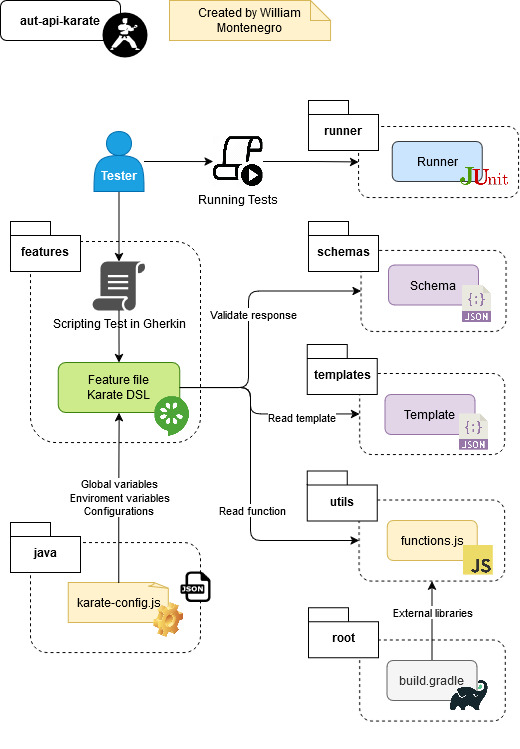

# Karate-DSL API Automation Framework

Framework de automatización de pruebas para APIs REST utilizando Karate-DSL.
Este proyecto está diseñado para facilitar la escritura de pruebas en formato BDD (Gherkin) y la validación de respuestas JSON mediante esquemas y datos esperados.

## 🚀 Características

- Estructura modular para organizar pruebas, esquemas y datos esperados.
- Validación de respuestas utilizando archivos de esquema (`schema`) y datos esperados (`expected`).
- Uso de plantillas (`templates`) para definir estructuras comunes de solicitudes.
- Ejecución de pruebas mediante JUnit y Gradle.
- Soporte para múltiples entornos a través de configuraciones en `karate-config.js`.

## 🛠️ Tecnologías Utilizadas

- **Lenguaje de programación**: Java y Javascript
- **Frameworks de automatización**:
    - [Karate DSL](https://github.com/karatelabs/karate)
    - [JUnit](https://junit.org/)
- **Herramientas adicionales**:
    - [Gradle](https://gradle.org/)

## 📂 Arquitectura del Proyecto



## 📋 Instalación

### Clonar el Repositorio

```
git clone https://github.com/wpmontenegro/aut-api-karate.git
cd aut-api-karate
```

### Instalación de Dependencias

```
gradlew build -x test
```

## ▶️ Ejecución de pruebas

### Pruebas locales

1. Establezca las **Credenciales de Auht0 y Mailsac** como variables de entorno:
```
export AUTH0_CLIENT_ID=id_cliente_auth0
export AUTH0_CLIENT_SECRET=secret_cliente_auth0
export MAILSAC_API_KEY=api_key_mailsac
export REQRES_API_KEY=api_key_reqres
``` 
2. Ejecutar las pruebas:
```
gradlew clean test -Dkarate.env={ENV}
```

## 🔧 Configuración

### Parámetros

`environment` (requerido):

Especifica el ambiente donde se ejecutaran las pruebas

```
dev (para ambiente DEV)
qa (para ambiente QA)
```

### Karete Config

Este proyecto utiliza `karate-config.js` para gestionar configuraciones clave y facilitar la ejecución en distintos entornos (dev, qa).
El archivo se encuentran en:

```
src/test/java/
├── karate-config.js  # Configuraciones generales para ejecución en diferentes ambientes
```

Se debe setear la url del tenant propio de Auth0 en la variable `auth0.url` dentro de este archivo

## 📊 Reportes de Pruebas

Los reportes de las ejecuciones se generan automáticamente en formato HTML y se almacenan en la carpeta `build/karate-reports`.
Para visualizar el reporte:

```
open build/karate-reports/features.userExample.html
```

## 📬 Contacto

Para preguntas o sugerencias, puedes contactarme a través de:

- Correo electrónico: wmontenegro@outlook.com.pe
- LinkedIn: [**wmontenegro**](https://www.linkedin.com/in/wmontenegro)
- GitHub: [**wpmontenegro**](https://github.com/wpmontenegro)