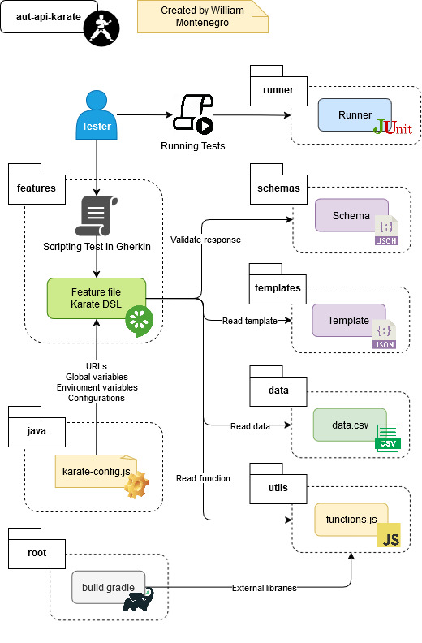

## Karate-DSL API Automation Framework

Framework de automatización de pruebas para APIs REST utilizando Karate-DSL, facilitando la escritura de pruebas en formato BDD (Gherkin) y la validación de respuestas JSON mediante esquemas y datos esperados.

## 🏛️ Arquitectura

Este proyecto está construido con Karate y Cucumber.



---
## 🚀 Características Principales

- **Estructura modular** para organizar pruebas, esquemas y datos esperados.
- **Validación de respuestas** utilizando archivos de esquema (`schema`) y datos esperados (`expected`).
- **Uso de plantillas (`templates`)** para definir estructuras comunes de solicitudes.
- **Ejecución de pruebas** mediante JUnit y Gradle.
- **Soporte para múltiples entornos** a través de configuraciones en `karate-config.js`.

## ⚙️ Requisitos Previos

- **Java 8** o superior
- **Gradle 6.0** o superior

## 🧪 Ejecución de Pruebas

Para ejecutar todas las pruebas, utiliza el siguiente comando:

```
gradlew clean test --tests "*.TestRunner"  -Dkarate.env={ENV}
```

El archivo karate-config.js permite definir configuraciones específicas por entorno. Puedes establecer el entorno deseado al ejecutar las pruebas.